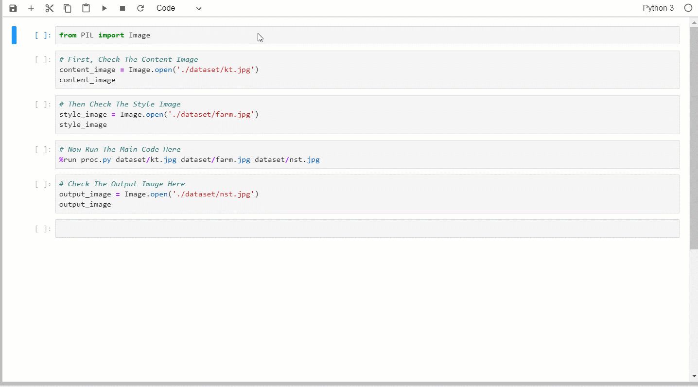

## English

The Content Image:

The Style Image:

Check The Output:

FOR MORE DETAILS, YOU CAN CHCEK MY PREVIOUS POST [HERE](https://ultradata.stream/dl/nst/)

**PLEASE USE YOUR OWN TRANING MODELS AND PARAMETERS IN PRODUCTION**.

## Chinese

好久了, 代码仅做参考, 希望你能Get到Neural Style Transfer算法迭代的大致过程 (毕竟是个Demo, 不必太较真). 

## LICENSE
APACHE LICENSE
